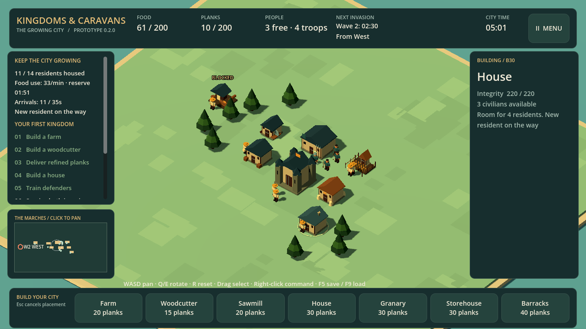

# Kingdoms & Caravans 0.3.1

A very early Windows playtest of **The Growing City**: build a settlement, keep its supply chains working, and defend it through two raids.

[Download for Windows x64](https://github.com/RoyGSlade/KingdomsAndCaravans/releases/download/v0.3.1/KingdomsAndCaravans-windows.zip) · [Showcase](https://donavencrenshaw.com/kingdoms-caravans/) · [Release notes](RELEASE-NOTES.md)

This is an unfinished, unsigned prototype. Balance, presentation and performance are still being tested. Caravans and multiplayer are not included.

## Play

1. Download and extract the small installer ZIP (38.1 MB).
2. Run `KingdomsAndCaravans.exe` and choose **Install and play**. It downloads and verifies the full game (164.9 MB).
3. Choose **Begin your kingdom**, or load your existing kingdom.
4. After installation, the same executable works offline.

For an offline installation or to copy the full game to another PC, use the [full Windows ZIP](https://github.com/RoyGSlade/KingdomsAndCaravans/releases/download/v0.3.1/KingdomsAndCaravans-full-windows.zip). Extract it and run the game directly.

Godot, Blender and Python are not needed. The installer needs an internet connection once; the installed game plays offline. The included `READ-ME.txt` contains controls and the full playtest guide. Godot notices are in `licenses/`. Windows may warn about the unsigned executable; the release includes a ZIP checksum for verification.

## New in 0.3.0

- Expanded food chains, diet and happiness, restaurants, equipment production and armored troops.
- A larger map with finite trees and mineral deposits. Gatherers search the nearest reachable resources without a maximum distance; long walks reduce output.
- Walls, gates, stairs and garrisons with material costs. Archers reach elevated posts through connected stairs and decks and fire from walls or garrisons.
- Worker-built stone roads in 2 × 2 sections. The movement bonus begins when construction finishes.
- Compact construction icons, a separate Defenses category, keyboard selection and building descriptions with costs.
- Freeze/Play for inspection, with one construction allowed per freeze. Green circles show troop destinations.
- Continue Building after defeating both invasions.

## Controls

| Input | Action |
| --- | --- |
| WASD / Q, E / mouse wheel | Pan / rotate / zoom |
| R | Reset camera; choose stair orientation while placing stairs |
| Left click / left drag | Select / box-select soldiers |
| Right click ground or enemy | Move selected soldiers / attack |
| Right click completed wall or garrison | Post selected archers; connected stairs required |
| H | Hold position |
| Tab / 1–9, 0 | Cycle construction categories / choose a visible slot |
| Space or Freeze/Play | Stop or resume simulation; one construction per freeze |
| Esc | Cancel placement or open the pause menu |
| F5 / F9 / F11 | Save / load confirmation / fullscreen |

## Saves and updates

Version 0.3.1 keeps the version-2 save format used by 0.2.x: `kingdom-city-v2.json` and its `.bak` backup. Existing saves retain their map size; start a new kingdom for the full map and guided opening. Version 0.1 saves require the retained old build.

**Upgrading from 0.2.1 or 0.3.0:** use the existing in-game updater. The small compatibility installer fits the original updater limits, then downloads and verifies the full game. Your old install and version-2 save stay in place. Cancelling or a failed download leaves the previous shortcut usable.

In the menu choose **Check for updates**, then **Download update**, then **Restart with update** when ready. The verified download installs beside the old version, and the game saves before switching. GitHub checks and downloads need an internet connection; normal play works offline.

Existing shortcuts forward to an activated newer build. To deliberately launch an old build, use `-- --skip-update-forward`.

## Feedback

[Send playtest feedback](https://github.com/RoyGSlade/KingdomsAndCaravans/issues/new?template=playtest.yml). Include your version, what you tried, what happened and what you expected. Reports about confusing shortages, stair access, construction controls and the first raid are especially useful.

This repository hosts player information and release downloads. Game source remains private; no open-source license is granted for the game. Bundled Godot notices are included in the ZIP.
